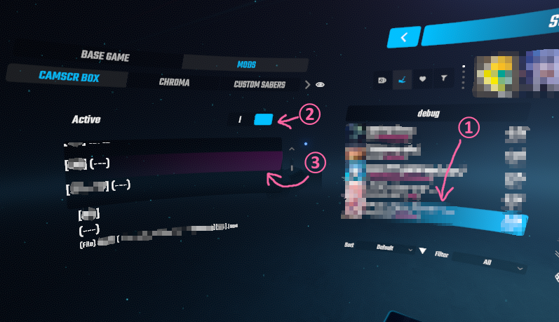
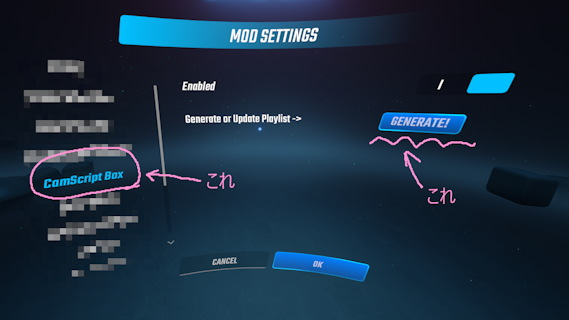

# CameraPlus MovementScript Box
CameraPlusの動作を勝手に変更するMOD。CameraPlus用のMovement Script (カメラスクリプト) の選択をin-gameからできるようにします。

- 曲ごとのカメラスクリプトは、本来は曲フォルダに入れる必要がありますが、このMODでは専用のフォルダに入れます。
- 曲ごとのカメラスクリプトは、本来は一度入れたら毎回必ず実行される仕様ですが、このMODではスクリプトの実行の有無を選択できます。
- 曲ごとのカメラスクリプトは、本来は複数入れることはできませんが、このMODでは複数のスクリプト候補から選べます。
- 実行中のカメラスクリプトの作者を、パネル (`StandaloneBeatmapInformation`) に表示できます。 (v0.3.1以降)
- このMODで入れているカメラスクリプトの対象マップを抽出し、プレイリスト化できます。 (v0.4.1以降)

## 注意
かめぷらに勝手にパッチを当てます。すのーさんには内緒だよ☆

かめぷらのバージョンアップ次第では動かなくなるので、覚悟の準備をしておいてください。

## 動作環境
ゲーム本体の対応バージョンと依存MODは [manifest.json](CameraPlusMovementScriptBox/manifest.json) を見てください。

特に以下のMODはよく確認しましょう。
- CameraPlus
- SongDetailsCache
- BeatSaberPlaylistsLib

## インストール
`CameraPlusMovementScriptBox.dll` を `Plugins` フォルダに置くだけ。

## 使い方
- CameraPlusの設定で `Song specific script` は有効にしてください。

- カメラスクリプトは、後述のルールに従ってファイル名を設定し `UserData\CameraPlusMovementScriptBox` に置いてください。
  ※このフォルダは、MODを入れてゲームを起動すると自動生成されます。

- 正しくカメラスクリプトが認識されていれば、ゲーム内の曲選択画面で曲を選択したとき(①)に、左側の `CamScr Box` タブにその曲に対応するカメラスクリプトの候補が表示されます。
  以下の両方を行って曲のプレイを開始すると、カメラスクリプトが実行されます。
  - `Active` スイッチをオンにする(②)
  - 使いたいスクリプトを選択する(③)
  
  

- プレイリストを作る方法は、後述します。

## ファイル名のルール
以下の2方式のうち、好きなほうを使ってね。1.のほうが簡単なのでおすすめ。混在してもいいよ。

1. カメラスクリプトを単独で置く方式 (簡単)

   ファイル名を以下のようにします。
	```
	<bsr番号> (<曲名> - <Mapper名>)<スクリプト名>[<スクリプト作者名>].json

	  例1： "1ba13 (yas love beam)○○イベント用[yas].json"
	  例2： "1ba13 (yas love beam)[yas].json"
	```

	- `<bsr番号>` は小文字で正確に。(必須)
    - `<スクリプト作者名>` はカメラスクリプトの作者名を書いてね。(必須)
	- (`<曲名> - <Mapper名>`) の部分は内部的には使ってないので括弧さえ書いてあれば内容はどうでも良いのですが、曲フォルダ名にそろえて「(曲名 - Mapper名)」などにすることを推奨します。
	- `<スクリプト名>` は自分で識別しやすいように好きに書いてね。1曲1個しか置かないなら何でもいいと思います。(なくても良い)

1. カメラスクリプトをメタ情報と一緒にフォルダに入れて置く方式 (面倒)

   フォルダを作成し、その中に以下の2ファイルを置いてください。大文字小文字に注意してね。
   ```
   <適当なフォルダ名>\
     ├── info.json
     └── SongScript.json
   ```

   - `<適当なフォルダ名>` は本当に何でもいいですが、曲フォルダ名にそろえて「`<bsr> (<曲名> - <Mapper名>)`」などのようにすることを推奨します。
   - `SongScript.json` はカメラスクリプトそのものです。
   - `info.json` は以下のようなjsonファイルを作ってください。
     ```
     {
       "Title": "<スクリプト名>",
       "Bsr": "<bsr>",
       "SongHash": "<song hash>",
       "Author": "<スクリプト作者名>",
       "Description: "<説明文>"
     }
     ```
     - `<bsr>`, `<スクリプト名>` は、上と同じです。
     - `<bsr>` か `<song hash>` のどちらかは必須です。こっちの方法なら song hash でも指定できます。song hashはたぶん全部大文字。
     - `<説明文>` はこっちの方式でしか入力できない要素です。長文でもいいけど、UIの表示領域からはみ出すかもね。

## ファイル置き場のルール
上記1.か2.の方式で作ったファイル/フォルダを、 `UserData\CameraPlusMovementScriptBox` に置きます。

- このフォルダに直接置いて大丈夫です。
- サブフォルダ分けして管理したい場合は、 "_" で始まる任意の名前でサブフォルダを作ってその中に入れてください。(ただしサブフォルダは1階層まで)

  ```
  (例)
  UserData\CameraPlusMovementScriptBox\
    ├── 1ba13 (yas love beam)[yas].json                    (*1)
    └── _やす
          └── 1ba13 (yas love beam)○○イベント用[yas].json   (*2)

      ↑直接(*1)でもサブフォルダ内(*2)でも大丈夫です。
  ```

## 使い方(プレイリスト)
カメラスクリプトが入ったマップをプレイリスト化できます。
- プレイリストを作成するには、 `MOD Settings` 画面の `CamScript Box` のページを開き、その中にある `Generate` ボタンを押してください。

  

- プレイリストは `CameraScriptBox` という名前で作成されます。既に同じ名前のプレイリストがある場合は、完全に上書きされます。
- プレイリストのカバー画像はこれになります → 

- 以下の注意点に気を付けてね。
  - プレイリスト化されるのは、本MODでカメラスクリプトを導入したマップだけです。マップ自体はローカルに存在しなくても大丈夫です。
  - プレイリスト化されるのは、bsrが指定されているマップだけです。
  - (Optional) プレイリストはサブフォルダ内に出力できますが、有効にするには設定ファイルに直接記載する必要があります。
    `UserData\CameraPlusMovementScriptBox.json` の `PlaylistSubdirectoryName` という項目にサブフォルダ名を記載してください。空文字列に戻せば、サブフォルダを使わなくなります。
  

